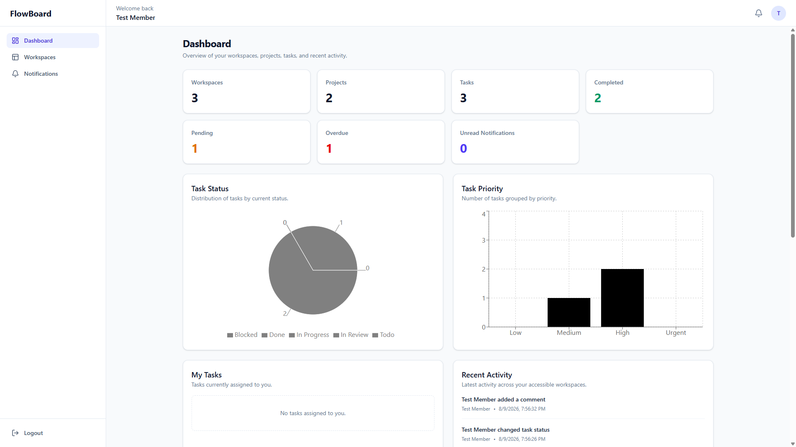
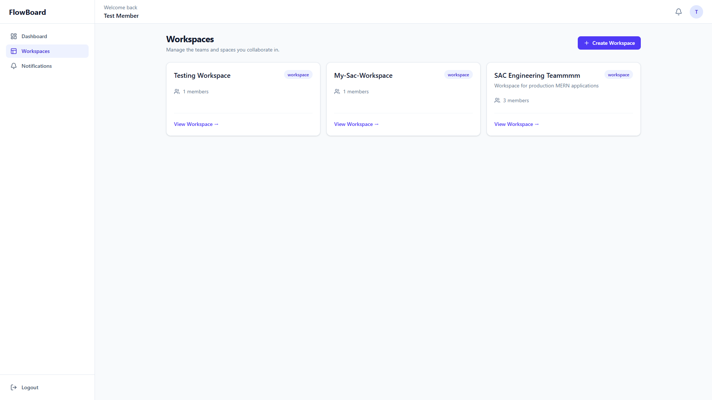
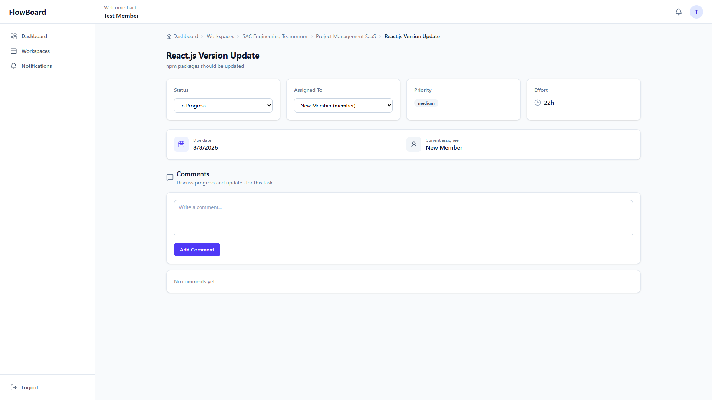
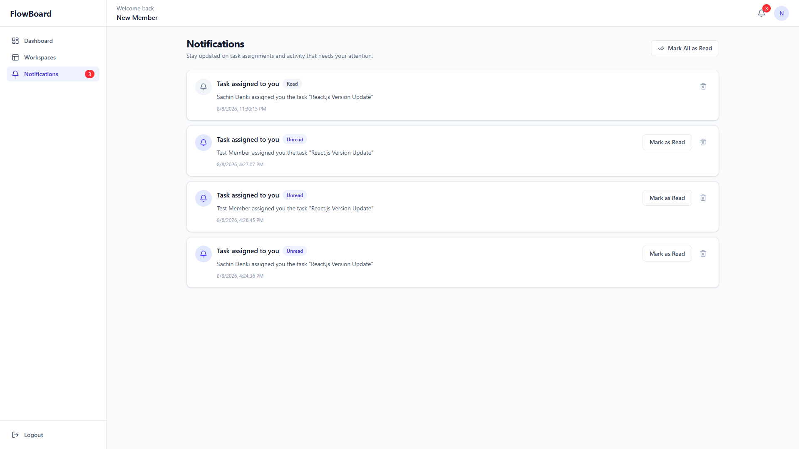
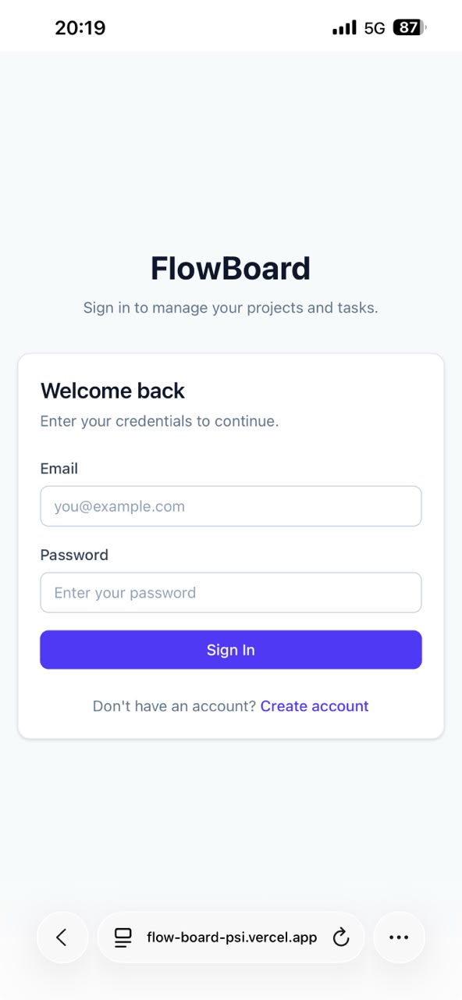

# FlowBoard

> A production-ready MERN project management platform for managing
> workspaces, projects, tasks, team collaboration, notifications,
> activity tracking, and analytics.

FlowBoard is a full-stack portfolio project built to demonstrate
real-world application architecture beyond basic CRUD. It includes
authentication, role-based permissions, workspace and project
management, task workflows, MongoDB analytics, Redux state management,
automated testing, Docker, CI, and cloud deployment.

## 🚀 Live Application

-   **Frontend:** https://flow-board-psi.vercel.app
-   **Backend API:** https://flowboard-api-otnm.onrender.com
-   **API Health:** https://flowboard-api-otnm.onrender.com

> The backend is hosted on Render, so the first request may take a
> little longer if the service has been idle.

------------------------------------------------------------------------

## ✨ Features

### Authentication & Authorization

-   User registration and login
-   JWT-based authentication
-   Protected frontend routes
-   Protected backend APIs
-   Role-based access control
-   Workspace-level membership and permission checks

### Workspaces

-   Create and manage workspaces
-   Workspace ownership
-   Member management
-   Owner, Admin, Manager, and Member roles
-   Workspace invitations
-   Accept and decline invitation workflows
-   Permission-based actions

### Projects

-   Create and manage projects
-   Project status management
-   Priority management
-   Archive and unarchive projects
-   Workspace/project permission validation

### Tasks

-   Create and update tasks
-   Assign tasks to workspace members
-   Prevent invalid/non-member assignments
-   Task priorities
-   Task statuses
-   Due dates
-   Estimated hours
-   Tags
-   Completion tracking
-   Pagination
-   Task detail view

### Collaboration

-   Task comments
-   Delete comments
-   Activity timeline
-   Assignment/activity tracking
-   Recent activity

### Notifications

-   Notifications for important task activity
-   Read/unread state
-   Mark individual notification as read
-   Mark all notifications as read
-   Delete notifications
-   Global unread notification count using Redux Toolkit
-   Notification badge in the application layout

### Dashboard & Analytics

-   Workspace count
-   Project count
-   Task count
-   Completed tasks
-   Pending tasks
-   Overdue tasks
-   Unread notifications
-   Task status distribution
-   Task priority distribution
-   Assigned task overview
-   Recent activity
-   MongoDB aggregation-based statistics

### UI / UX

-   Responsive React interface
-   Desktop and mobile support
-   Reusable UI components
-   Loading states
-   Empty states
-   Error states
-   Charts and dashboard visualizations

------------------------------------------------------------------------

## 🛠 Tech Stack

### Frontend

-   React.js
-   Vite
-   JavaScript
-   Redux Toolkit
-   React Router
-   Tailwind CSS
-   Axios
-   Recharts
-   Lucide React
-   Vitest
-   React Testing Library
-   user-event
-   jsdom

### Backend

-   Node.js
-   Express.js
-   MongoDB
-   Mongoose
-   JWT
-   bcrypt
-   REST APIs
-   Validation
-   Jest

### DevOps & Deployment

-   Docker
-   Git
-   GitHub
-   GitHub Actions
-   Vercel
-   Render
-   MongoDB Atlas

------------------------------------------------------------------------

## 🏗 Architecture

``` text
                         FlowBoard
                             │
              ┌──────────────┴──────────────┐
              │                             │
       React + Vite                     Node.js
         Frontend                       Express API
              │                             │
       React Router                      Routes
              │                             │
       Redux Toolkit                   Middleware
              │                             │
       Axios Services                 Controllers
              │                             │
              └──────── REST API ─────── Services
                                            │
                                         Mongoose
                                            │
                                      MongoDB Atlas
```

### Production Architecture

``` text
                         GitHub
                            │
                     GitHub Actions
                            │
                    Tests + Build
                            │
               ┌────────────┴────────────┐
               │                         │
            Vercel                    Render
               │                         │
        React Frontend             Dockerized API
               │                         │
               └──────── HTTPS ──────────┤
                                         │
                                    MongoDB Atlas
```

------------------------------------------------------------------------

## 🔄 Application Flow

``` text
Register / Login
       │
       ▼
   Dashboard
       │
       ▼
   Workspace
       │
       ├── Members
       ├── Invitations
       │
       ▼
     Project
       │
       ▼
      Tasks
       │
       ├── Assignment
       ├── Status
       ├── Priority
       ├── Comments
       │
       ▼
Activity Timeline
       │
       ▼
 Notifications
```

------------------------------------------------------------------------

## 🔐 Role-Based Access Control

FlowBoard applies authorization on the backend instead of relying only
on hidden frontend buttons.

Typical workspace roles include:

  Role          Responsibility
  ------------- ------------------------------------------------------
  **Owner**     Full workspace control and highest-level permissions
  **Admin**     Administrative workspace/project operations
  **Manager**   Project and task workflow management
  **Member**    Task execution and collaboration

Additional rules restrict sensitive operations. For example, elevated
roles cannot simply be assigned by unauthorized workspace members.

------------------------------------------------------------------------

## 📋 Task Workflow

Tasks support a workflow such as:

``` text
Todo
  │
  ▼
In Progress
  │
  ▼
In Review
  │
  ▼
Done
```

Tasks can also represent blocked work.

Task information can include:

-   Title
-   Description
-   Status
-   Priority
-   Assignee
-   Due date
-   Estimated hours
-   Tags
-   Completion timestamp
-   Comments
-   Activity history

------------------------------------------------------------------------

## 🔔 Notification State with Redux Toolkit

Notifications are stored in shared Redux state so multiple parts of the
interface remain synchronized.

``` text
Backend
   │
   ▼
Notification API
   │
   ▼
Redux notificationSlice
   │
   ├── notifications[]
   └── unreadCount
          │
          ├── Topbar Bell
          └── Notifications Page
```

When a notification is marked as read or deleted, Redux updates the
shared state and the corresponding UI updates from the same source of
truth.

------------------------------------------------------------------------

## 📊 MongoDB Aggregation

FlowBoard uses MongoDB aggregation for dashboard and project statistics
rather than loading every document into Node.js and calculating
everything in application memory.

Aggregation is used for data such as:

-   Workspace statistics
-   Project statistics
-   Task status counts
-   Priority counts
-   Completion statistics
-   Dashboard analytics

This project provided practical experience with MongoDB aggregation
pipelines in a real application.

------------------------------------------------------------------------

## 🧪 Testing

FlowBoard contains automated tests on both the frontend and backend.

### Frontend Testing

Frontend testing uses:

-   Vitest
-   React Testing Library
-   user-event
-   jsdom
-   API/service mocking

Current frontend test result:

``` text
Test Files: 8 passed
Tests:      27 passed
```

The suite covers areas such as:

-   Authentication Redux state
-   Notification Redux state
-   Protected routes
-   Login behavior
-   API success/failure behavior
-   Dashboard rendering
-   Workspace rendering and creation
-   Notifications
-   Mark as read
-   Mark all as read
-   Delete notification
-   Loading and error states

### Backend Testing

The Node/Express backend uses Jest to test application behavior
including authentication, authorization, services, validations,
workspace/project/task operations, and related business logic.

Available scripts include:

``` bash
npm test
npm run test:watch
npm run test:coverage
```

------------------------------------------------------------------------

## 🔁 Continuous Integration

GitHub Actions is used to automatically verify the project.

``` text
Push / Pull Request
        │
        ▼
  GitHub Actions
        │
        ├── Install dependencies
        ├── Run automated tests
        └── Verify production build
                │
                ▼
             Pass / Fail
```

This helps catch regressions before changes reach production.

------------------------------------------------------------------------

## 🐳 Docker

The backend is containerized using Docker.

The production image uses Node.js and runs the existing backend
production start command.

### Build the backend image

``` bash
cd server
docker build -t flowboard-api .
```

### Run the backend container

``` bash
docker run --name flowboard-api-container --env-file .env -p 5000:5000 flowboard-api
```

Verify it using:

``` text
http://localhost:5000/api/health
```

Expected response:

``` json
{
  "success": true,
  "message": "Backend running successfully"
}
```

------------------------------------------------------------------------

## 💻 Local Development

### Prerequisites

Install:

-   Node.js
-   npm
-   Git
-   MongoDB Atlas account or MongoDB instance
-   Docker (optional for containerized backend execution)

### Clone

``` bash
git clone <your-repository-url>
cd FlowBoard
```

### Backend

``` bash
cd server
npm install
npm run dev
```

Create `server/.env`:

``` env
NODE_ENV=development
PORT=5000
MONGODB_URI=your_mongodb_connection_string
JWT_SECRET=your_secure_jwt_secret
JWT_EXPIRES_IN=7d
CLIENT_URL=http://localhost:5173
```

Never commit `.env` or production credentials.

### Frontend

``` bash
cd client
npm install
npm run dev
```

Create `client/.env` if required by your API configuration:

``` env
VITE_API_URL=http://localhost:5000
```

------------------------------------------------------------------------

## 🌐 Production Deployment

### Frontend --- Vercel

The React/Vite frontend is deployed on Vercel.

Because FlowBoard uses React Router as a client-side SPA, Vercel is
configured to route application paths back to `index.html`, allowing
routes such as `/login`, `/dashboard`, and `/workspaces` to work on
direct navigation and refresh.

### Backend --- Render

The Express backend is deployed to Render using the backend Dockerfile.

Render injects the production port through `process.env.PORT`, while
local development falls back to port `5000`.

Production secrets and configuration are stored as Render environment
variables instead of being included in the Docker image.

### Database --- MongoDB Atlas

Production application data is stored in MongoDB Atlas.

### Production CORS

The API restricts browser access to the configured production client URL
through environment-based CORS configuration.

------------------------------------------------------------------------

## 📁 Project Structure

``` text
FlowBoard/
│
├── client/
│   ├── src/
│   │   ├── components/
│   │   ├── features/
│   │   ├── pages/
│   │   └── test/
│   ├── package.json
│   └── vercel.json
│
├── server/
│   ├── src/
│   ├── Dockerfile
│   ├── .dockerignore
│   └── package.json
│
├── .github/
│   └── workflows/
│
└── README.md
```

------------------------------------------------------------------------

## 📸 Screenshots

Add your final production screenshots to a folder such as
`docs/screenshots/` and update the paths below.

### Dashboard

``` md

```

### Workspaces

``` md

```

### Project

``` md

```

### Task Details

``` md

```

### Notifications

``` md

```

### Mobile View

``` md

```

------------------------------------------------------------------------

## ✅ Production Validation

The deployed application has been manually verified across the core
workflow, including:

-   Authentication
-   Login/logout
-   Protected routes
-   Multiple users
-   Workspace creation
-   Project creation
-   Task creation
-   Task assignment
-   Status updates
-   Comments
-   Notifications
-   Dashboard analytics
-   Production API connectivity
-   Production CORS
-   Direct route navigation
-   Desktop UI
-   Mobile UI

------------------------------------------------------------------------

## 🧠 Key Engineering Concepts Practiced

FlowBoard was intentionally built to cover practical full-stack
engineering concepts including:

-   Component-based React architecture
-   Client-side routing
-   Global state management with Redux Toolkit
-   REST API integration
-   JWT authentication
-   Authorization and RBAC
-   Express middleware
-   Service/controller separation
-   Mongoose modeling
-   MongoDB aggregation
-   Pagination
-   Validation
-   Error handling
-   Notifications
-   Activity tracking
-   Automated testing
-   Mocking
-   Docker images and containers
-   Environment variables
-   CI with GitHub Actions
-   Production deployment
-   CORS configuration
-   SPA deployment routing
-   Production debugging

------------------------------------------------------------------------

## 🔮 Future Improvements

FlowBoard V1 is intentionally complete. Potential future improvements
include:

-   Real-time updates with Socket.IO
-   AWS S3 task attachments
-   Email notifications
-   Password reset
-   Email verification
-   Refresh-token authentication
-   End-to-end testing with Playwright
-   Redis caching
-   Audit logs

These are considered future enhancements rather than requirements for
the current release.

------------------------------------------------------------------------

## 👨‍💻 Author

**Sachin Denki**

Full Stack Developer / Node.js Developer / MERN Stack Developer

React.js • Next.js • Node.js • Express.js • MongoDB

------------------------------------------------------------------------

## 📄 License

This project is available for portfolio and educational purposes.
